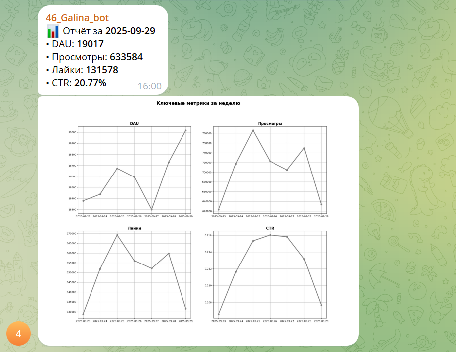

### "Автоматизация отчетности мобильного приложения"   

**Стек:** Airflow, Gitlab, Telegram, ClickHouse, Pandahouse, Matplotlib.  

**Описание задачи:**  
Необходимо наладить автоматическую отправку аналитической сводки в телеграм каждое утро.  

**Необходимо сделать:**  
1. создать телеграм-бота;   
2. написать скрипт для сборки отчета по ленте новостей;
3. отчет должен состоять из двух частей:
   - текст с информацией о значениях ключевых метрик за предыдущий день;
   - график со значениями метрик за предыдущие 7 дней;
4. отобразить в отчете следующие ключевые метрики:
   - DAU;
   - Просмотры;
   - Лайки;
   - CTR.
5. автоматизировать отправку отчета с помощью Airflow;    
4. код для сборки отчета разместить в GitLab.  

**Этапы работы:**
Создание телеграм-бота, написание скрипта для сборки отчета и автоматизирована отправка.  
Ознакомиться с файлом решения можно здесь: [Report](https://github.com/NailyaGalina/Airflow_reporting_automation/blob/main/DAG_report.py)   

**Результат:**  
Автоматизирована отправка отчета с ключевыми метриками приложения в телеграм.  

 
 

*Проект разработан мной на основе материалов, автор которых - [karpov.courses](https://karpov.courses)
